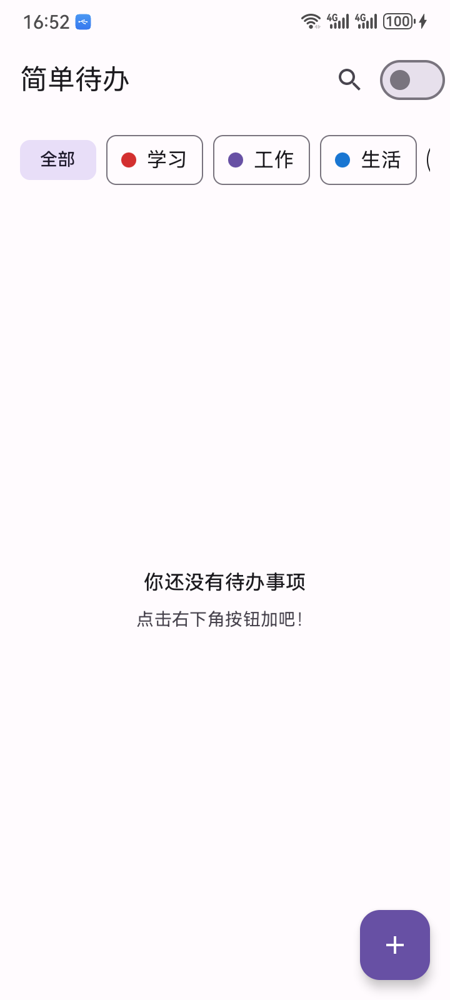
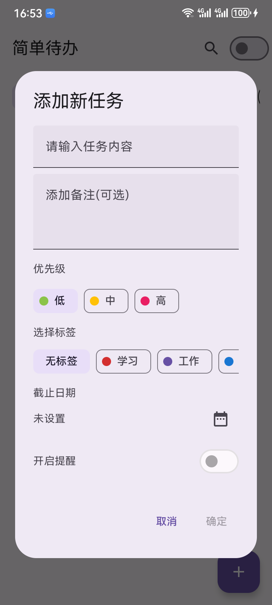
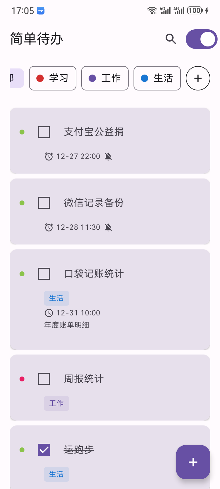
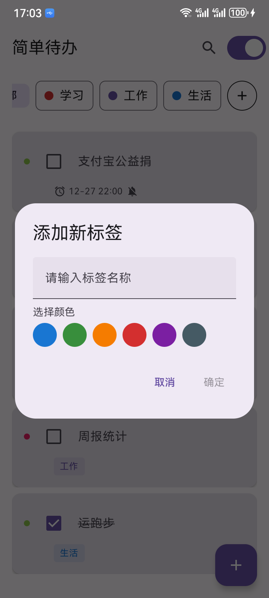
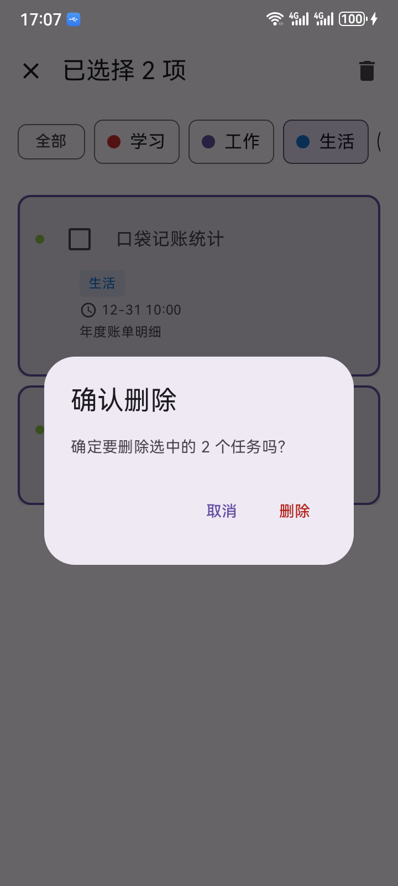
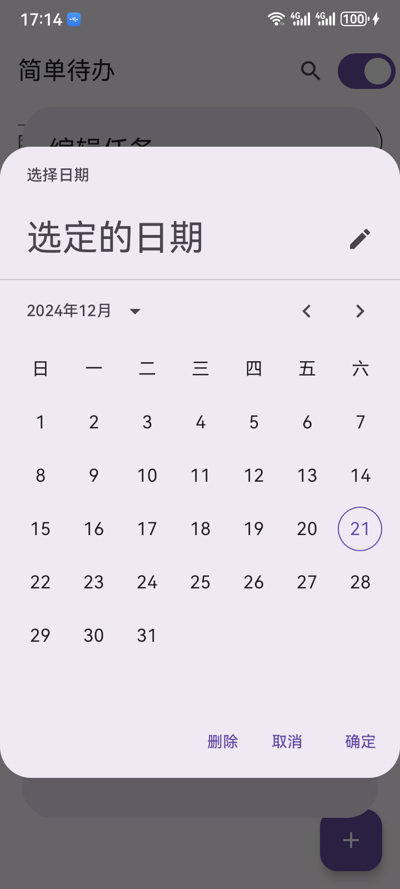

中文 | [English](README-en.md)

# 简单待办

一个使用最新 Android 技术栈开发的待办事项管理应用。

## 应用截图





<br></br>

## 下载体验

- 扫描二维码安装：<br></br>
  <a href="https://www.pgyer.com/YrsgyKDL"></a>

- [点击下载 simpletodo.apk][1]

## 功能特点

- ✅ 基础任务管理
    - 添加、编辑、删除任务
    - 任务标记完成/未完成
    - 支持任务优先级（高、中、低）
    - 支持添加任务备注
    - 批量选择和删除

- 🏷️ 分类管理
    - 自定义任务标签
    - 标签颜色定制
    - 按标签筛选任务

- ⏰ 时间管理
    - 设置任务截止日期
    - 到期提醒通知
    - 自动识别过期任务

- 🔍 搜索与过滤
    - 任务搜索
    - 显示/隐藏已完成任务
    - 多维度任务筛选

## 技术架构

- **UI**: Jetpack Compose + Material 3
- **架构模式**: MVVM
- **依赖注入**: Hilt
- **本地存储**: Room
- **后台任务**: WorkManager
- **异步处理**: Kotlin Coroutines + Flow

## 项目结构

```
app/src/main/
├── java/com/example/simpletodo/
│ ├── data/ # 数据层
│ │ ├── local/ # Room 数据库
│ │ ├── model/ # 数据模型
│ │ └── repository/ # 数据仓库
│ ├── di/ # 依赖注入
│ ├── ui/ # 界面层
│ ├── worker/ # 后台任务
│ ├── MainActivity.kt # 主活动
│ └── TodoApplication.kt # 应用入口
└── res/ # 资源文件
```

## 开发环境要求

- Android Studio Hedgehog | 2023.1.1 或更高版本
- JDK 17
- Android SDK 34
- Kotlin 1.9.0 或更高版本

## 构建与运行

1. 克隆项目 

git clone https://github.com/VIPyinzhiwei/SimpleToDo.git

2. 使用 Android Studio 打开项目

3. 同步 Gradle 依赖

4. 运行应用

## 主要依赖库

- Jetpack Compose: UI 框架
- Room: 本地数据库
- Hilt: 依赖注入
- WorkManager: 后台任务调度
- Material3: Material Design 3 组件
- Accompanist: 系统 UI 控制

## 许可证

[Apache License 2.0][2]

## 贡献指南

欢迎提交 Issue 和 Pull Request 来帮助改进项目。

1. Fork 项目
2. 创建特性分支
3. 提交变更
4. 推送到分支
5. 创建 Pull Request

## 联系方式

如有任何问题或建议，欢迎提交 Issue 或通过以下方式联系：

- Email: vipyinzhiwei@gmail.com
- Blog: vipyinzhiwei.com

[1]:https://github.com/VIPyinzhiwei/SimpleToDo/raw/main/simpletodo.apk
[2]:http://www.apache.org/licenses/LICENSE-2.0